# Окно модуля в BecqMoni — снимки экрана

Модуль `integration/` открывается из BecqMoni пунктом меню **Сервис → Конструктор ROI
и наборов нуклидов**. Снимки сделаны с живого окна, собранного вместе с приложением
(`BecquerelMonitor.exe`, Release, .NET Framework 4.8), русская культура интерфейса.

Окно повторяет веб-версию инструмента поэлементно: раскладка, палитра и шрифт взяты
из `styles/becqmoni.css` числом в число — веб-страница была обкаткой этого UI.
Живая страница: <https://vibeengineering-llc.github.io/becqmoni-roi-wizard/>

Снимки пересобираются харнессом `scratchpad/formshot` (см. `integration/README.md`):
он поднимает форму из собранного `BecquerelMonitor.exe`, прогоняет сценарий и снимает
каждый экран в своём состоянии.

---

## Шаг 1 · Изотопы

### Пустой старт
Три колонки — поиск по базе, готовая группа, панель ХРИ — и полоса «Выбрано» внизу.
В списке нуклидов цветные коды семейств (ANSI N42.34 плюс три группы вне стандарта),
период полураспада и число γ/X-линий; нуклид без линий выше порога базы показан серым.
Под полем поиска — пять готовых наборов.

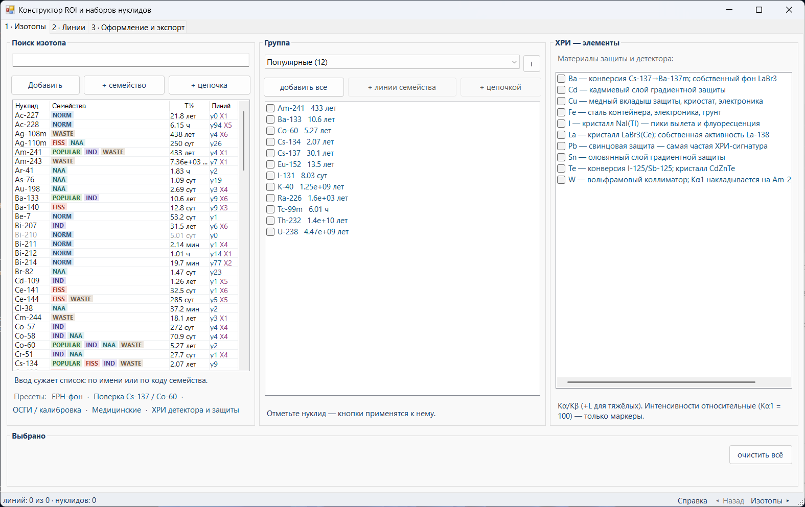

### Словарик кодов семейств
Кнопка «i» рядом с выбором группы: пояснение выбранного семейства и чем задана
классификация. Закрывается щелчком по себе и Esc.

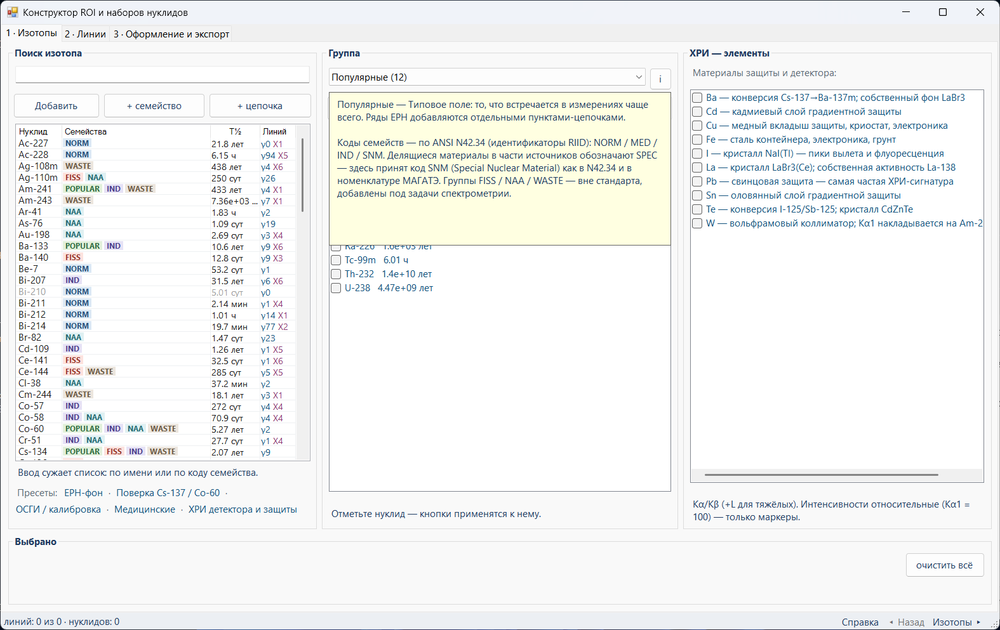

### Готовый набор в один клик
Пресет «ОСГИ / калибровка» — Am-241, Ba-133, Eu-152, Cs-137, Co-60: чипы внизу,
галки в списке группы, счётчик в строке состояния.

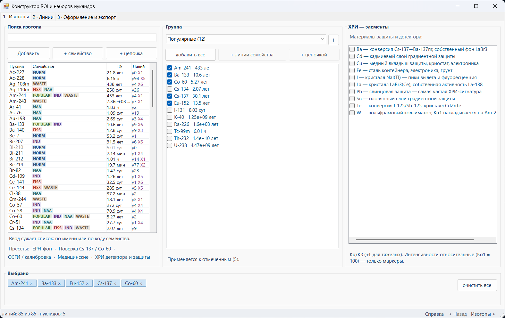

### Цепочка распада
Th-232 отмечен галкой, кнопка «+ цепочкой» собрала весь ряд отдельными нуклидами
с родителем в скобках имени — по этим скобкам `LibraryPeakFitter` узнаёт цепочку
и связывает амплитуды линий.

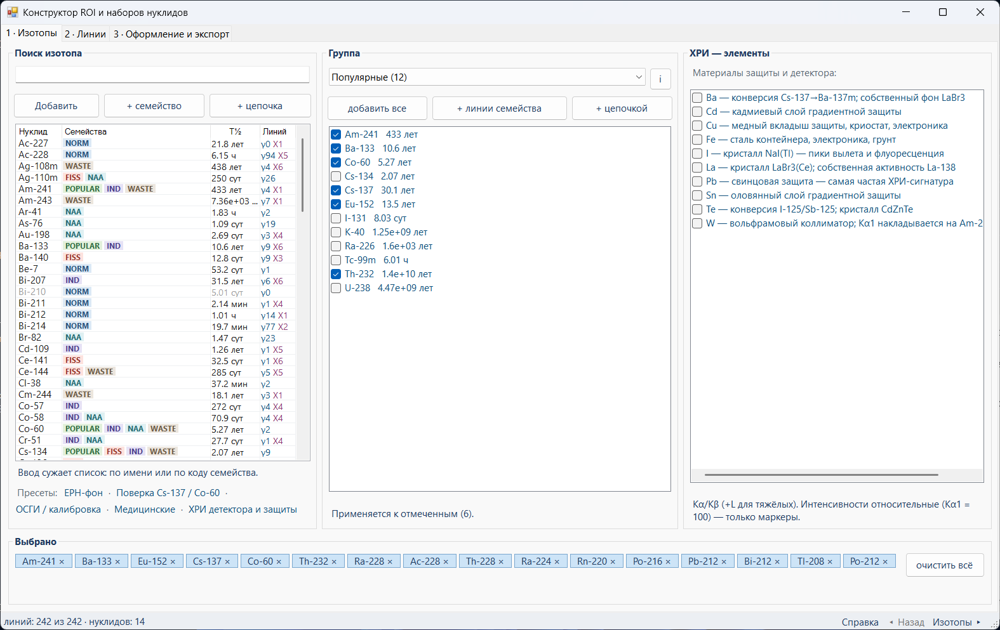

---

## Шаг 2 · Линии

### Обычный вид
Панели вторичных пиков и поиска близких линий свёрнуты, как на странице, — таблица
линий получает всю оставшуюся высоту. В колонке «I, %» микро-бар по относительной
интенсивности, в колонке «Тип» — бейджи γ / X / ХРИ / втор.

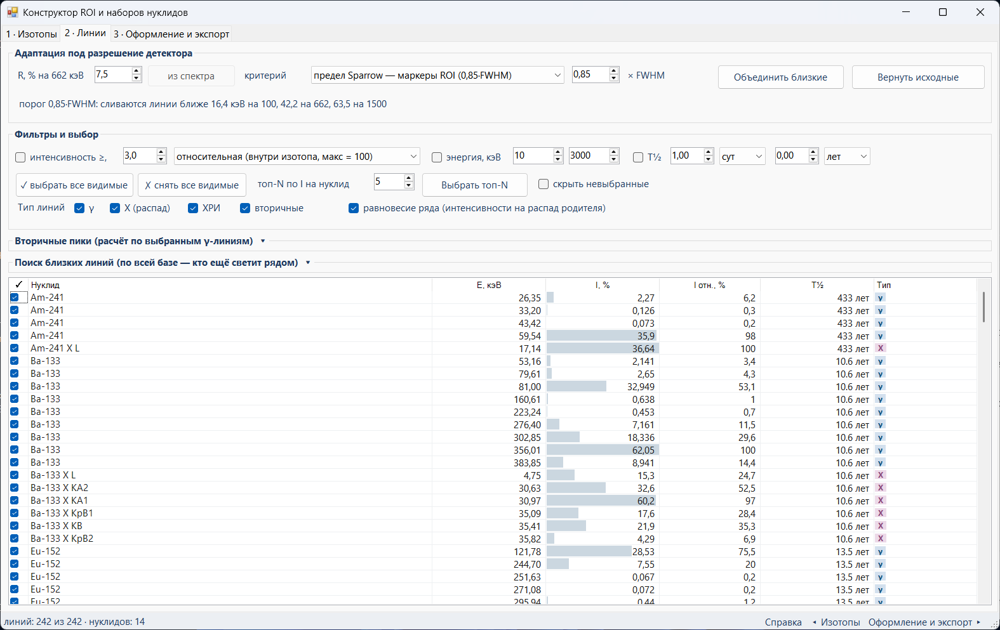

### Вторичные пики
Порог по родительской линии и восемь видов особенностей: обратное рассеяние,
комптон-край, вылеты 511 и 1022, вылет K-рентгена иода, аннигиляция, каскадное
суммирование, наложение. Расчёт по кнопке; прежние маркеры заменяются.

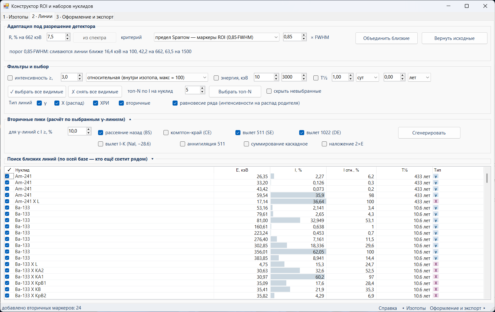

### Поиск близких линий по всей базе
Классический случай 186 кэВ: Ra-226 (3,565 %) против U-235 (57,2 %) — по одной линии
их не различить. Найденное добавляется в набор кнопкой или двойным щелчком.

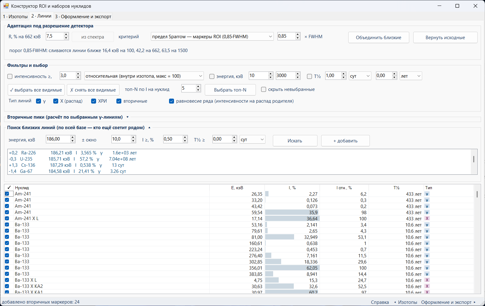

---

## Шаг 3 · Оформление и экспорт

### Цвета по цепочке
Маркеры или зоны, ширина зоны в процентах от энергии либо через k·FWHM. Цвет
назначается владельцу — корню ряда; щелчок по чипу открывает выбор цвета.

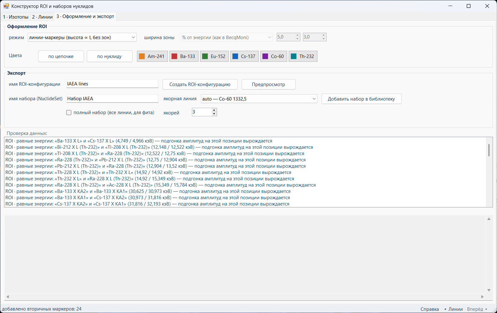

### Цвета по нуклиду
Тот же набор, но цвет у каждого нуклида свой.

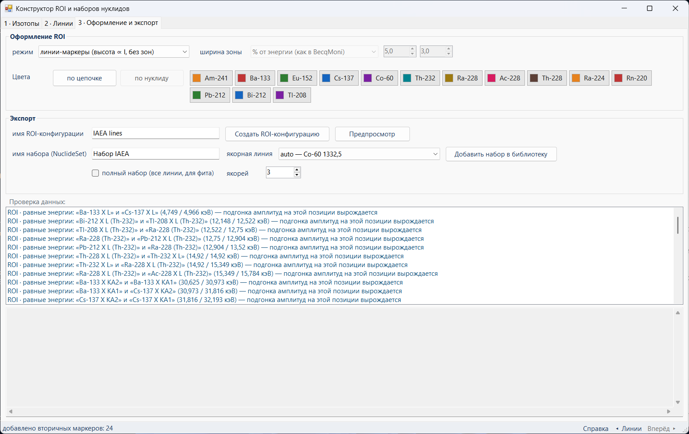

### Предпросмотр
Текст ROI-конфигурации до записи — тем же `XmlSerializer`, каким пишет
`ROIConfigManager.SaveConfig`. Выше — проверки данных: для ROI совпавшие энергии
и перекрытие зон совещательны, для набора первые две позиции блокируют запись.

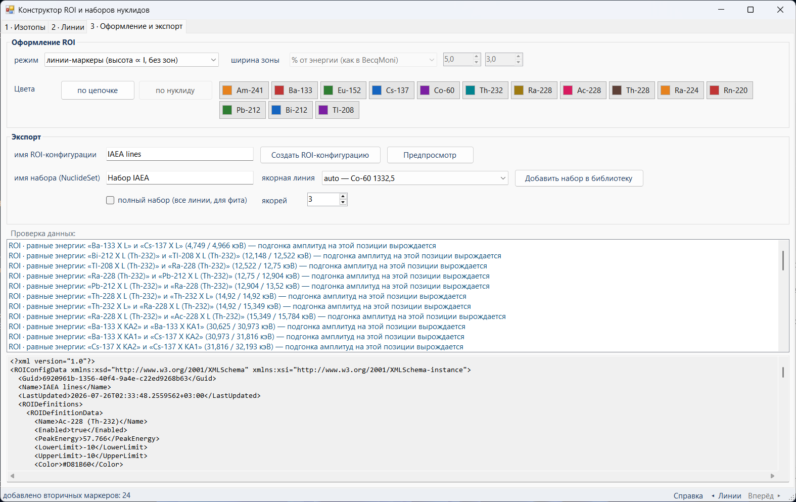

---

## Справка

Тот же текст, что в модальном окне страницы: он не переписан в код, а выгружается
из `index.html` скриптом `integration/tools/export_help.py` в ресурс `help.xml` —
иначе две версии разъехались бы после первой правки страницы.

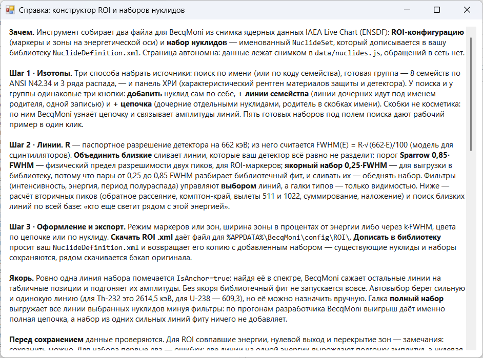

Таблица источников: что именно взято и откуда. Ссылки открываются в браузере.

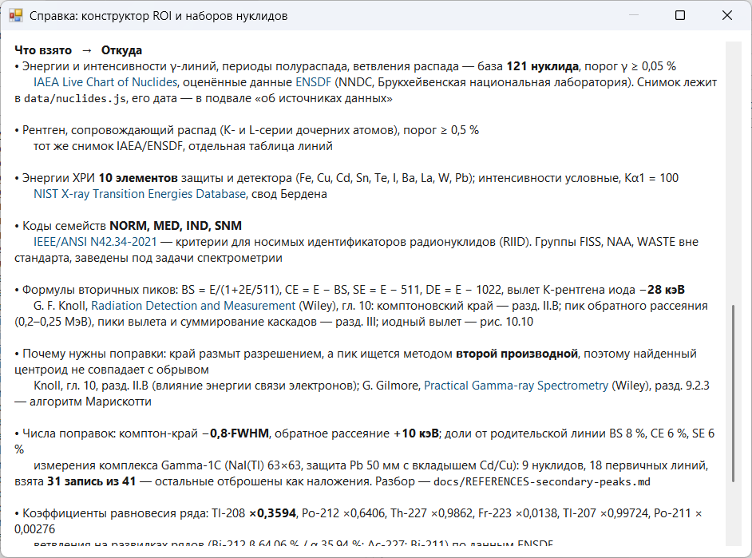

---

## Английский интерфейс

Подписи лежат в `RoiWizard/RoiWizardStrings.resx` (нейтральная, английская) и
`RoiWizardStrings.ru.resx`; MSBuild собирает из второй сателлит
`ru\BecquerelMonitor.resources.dll` — тот же механизм, что у остальных форм
BecqMoni. Язык берётся из культуры интерфейса, ничего переключать в окне не нужно.
Снимки ниже сделаны тем же прогоном при `en-US`.

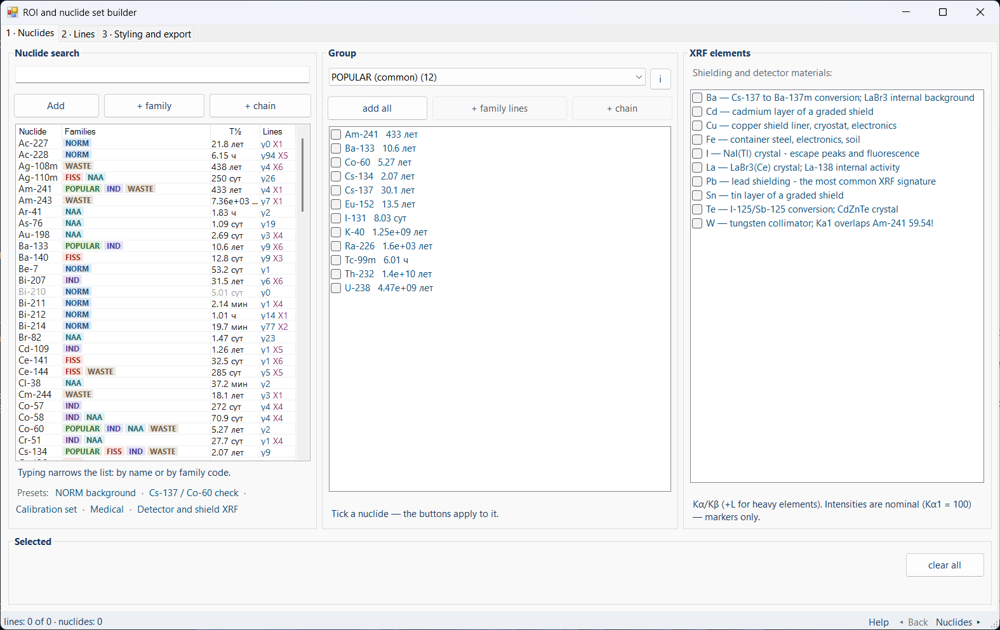

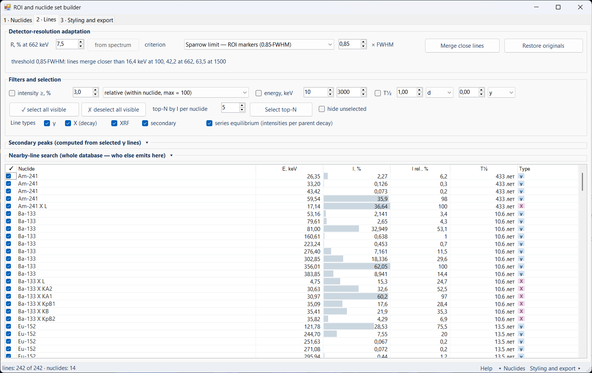

Панель «Data check» — та самая, что раньше оставалась русской при любой культуре:
ядро отдаёт код замечания и подстановки, фразу собирает форма.

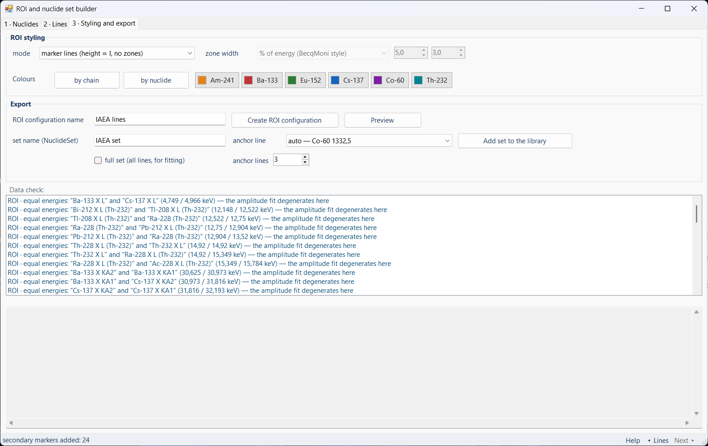

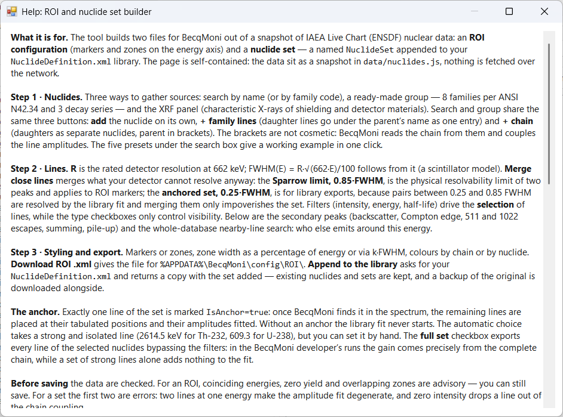
